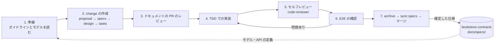

# bookstore-ordering

書店のオンライン注文を題材にした、勉強会用のサンプルのサービスリポジトリです。契約リポジトリ [bookstore-contracts](https://github.com/kmatsui058/bookstore-contracts) のドメインモデル（LikeC4）を正本として、Go のコードを書き、OpenSpec で確定させた仕様を契約リポジトリに戻すまでの流れを示します。

## このサンプルで見せること

- **ドメインモデルが正本**: 語（和名・英名）、状態の遷移、コマンドとイベントは、契約リポジトリのモデルにあるものだけを使う。GoDoc から LikeC4 のビュー ID を辿れる
- **契約からの生成**: 注文 API のサーバーのインターフェースと型は、契約リポジトリの OpenAPI の定義から生成する。列挙型の値が契約と一致することはテストで確かめる
- **イベントソーシングと CQRS**: 集約「注文」はイベントを当てはめることでだけ状態を変え、イベントの列（正本）と読み取り用のスナップショットを保存する。同じバージョンのイベントは衝突として拒む
- **仕様の流れ**: OpenSpec の change を作り、TDD で実装し、archive して確定した仕様を契約リポジトリの `docs/specs/` に同期する。例として change「注文のキャンセル」を1つ通してある
- **エージェントのハーネス**: `CLAUDE.md`・`.claude/`（フック・サブエージェント・OpenSpec のスキル）・`.gemini/` で、AI エージェントがガイドラインに従って作業するようにする

## 契約リポジトリとのつながり

契約リポジトリはサブモジュール `contracts/` として取り込んでいます。

| 契約リポジトリ（正本） | このリポジトリでの使い方 |
|---|---|
| `docs/domain/bookstore/ordering/**/*.c4`（注文コンテキストのモデル） | `internal/modules/order/domain/order/` の語・不変条件・状態の遷移の拠り所 |
| `ordering/definitions/openapi/openapi.yaml`（注文 API） | `task generate` で `internal/presentation/api/gen/` を生成する |
| `docs/guides/`（モデリング・ドキュメント・要件と仕様書のガイドライン） | `openspec/config.yaml` とエージェントの定義から参照する |
| `docs/specs/bookstore/ordering/`（確定した仕様の保管庫） | `task sync:specs` の同期先。`descriptions/bookstore-ordering/` に確定した仕様、`proposals/bookstore-ordering/` に archive した change を置く |

## ディレクトリ

```text
cmd/server/                         サーバーの起動
internal/
    shared/domain/                  イベントのメタデータ、共通語彙の識別子
    modules/order/
        domain/order/               集約「注文」（コマンド・イベント・状態・復元）
        app/command/                コマンドのユースケースと、使う側で定義したインターフェース
        app/query/                  スナップショットを読むユースケース
        infra/repository/inmemory/  メモリのイベントストアとスナップショット
        infra/messaging/inprocess/  プロセス内のイベントの公開
    presentation/api/               ハンドラー・変換・DI
    presentation/api/gen/           OpenAPI の定義から生成したコード（手で直さない）
openspec/                           仕様（specs）と変更（changes）
docs/                               実装とテストのガイドライン
contracts/                          契約リポジトリ（サブモジュール）
```

## 動かし方

必要なもの: Go（`.go-version` の版）、[Task](https://taskfile.dev/)、Node.js（OpenSpec の CLI を使うとき）。

```sh
git clone --recurse-submodules git@github.com:kmatsui058/bookstore-ordering.git
cd bookstore-ordering

task generate   # 契約の OpenAPI の定義からコードを、インターフェースからモックを生成する
task test       # テスト
task lint       # golangci-lint
task run        # :8080 で注文 API を起動する
```

別の端末から試します。

```sh
# 注文する（受付済みになる）
curl -s -X POST localhost:8080/orders -H 'Content-Type: application/json' \
    -d '{"customerID":"customer-1","lines":[{"bookID":"book-1","quantity":2,"unitPrice":1500}],"paymentMethod":"CREDIT_CARD"}'

ORDER_ID=<返ってきた orderID>

curl -s localhost:8080/orders/$ORDER_ID                  # 注文を取得する
curl -s -X POST localhost:8080/orders/$ORDER_ID/confirm  # 確定する
curl -s -X POST localhost:8080/orders/$ORDER_ID/cancel   # キャンセルする（出荷前だけ）
curl -s -X POST localhost:8080/orders/$ORDER_ID/cancel   # もう一度キャンセルすると 409
```

出荷済みにするのは `POST /orders/$ORDER_ID/ship` です（確定した注文だけ）。公開したドメインイベントは、サーバーのログに出ます。

## 開発のライフサイクル

作業は7つのフェーズで進めます。詳しくは [CLAUDE.md](./CLAUDE.md) にあります。



仕様を確定させて契約リポジトリに戻す手順です。

```sh
openspec archive <change>   # delta specs を openspec/specs/ に統合し、change を archive に移す
task sync:specs             # contracts/docs/specs/bookstore/ordering/ に同期する
cd contracts && git add docs/specs && git commit   # 契約リポジトリの中でコミットする
cd .. && git add contracts openspec && git commit  # サブモジュールのポインタと archive をコミットする
```
