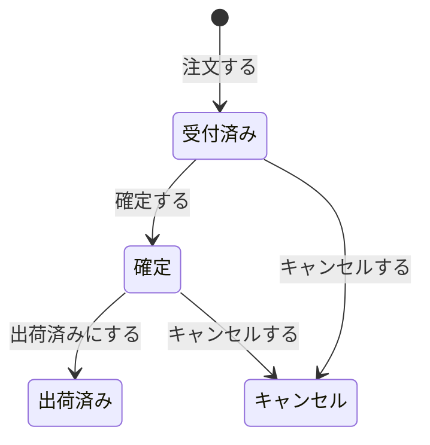

## Why

顧客は、注文したあとで気が変わったり、間違えて注文したりすることがあります。いまは一度出した注文を取り消す手段がないため、書店は出荷の準備を進めてしまい、顧客は届いた書籍を返品するしかありません。まだ書籍を配送業者に渡していない注文であれば、取り消せるようにしたいと考えています。

一方で、出荷済みの注文を取り消せてしまうと、書籍はすでに顧客に向かっているのに注文だけがなくなり、書店の記録と実際の書籍の動きが食い違います。そのため、取り消せるのは出荷前の注文に限ります。

## What Changes

- 出荷前（受付済み・確定）の注文を「キャンセルする」ことができるようにする。キャンセルした注文は「キャンセル」の状態になる
- 出荷済みの注文と、すでにキャンセルした注文は、キャンセルできないようにする。このとき注文の状態は変わらない
- 注文をキャンセルしたら「注文キャンセル」が起きたことを記録し、ほかの業務（請求など）がそれを知れるようにする

状態の移り変わりは、次のようになります（ドメインモデルのステートマシン `bkst_ordr_ordm_ord_state` と同じ）。

## Capabilities

### New Capabilities

- `order-cancellation`: 注文のキャンセル。どの状態の注文をキャンセルできるか、キャンセルしたときに何が起きるかを定める

### Modified Capabilities

なし（確定した仕様はまだない）

## Impact

- 語はドメインモデル（注文管理モジュール）にある「キャンセルする」「注文キャンセル」「キャンセル」をそのまま使う。モデルの変更はない
- 注文 API の「キャンセルする」を使えるようにする。API の定義（契約リポジトリ）の変更はない
- 請求コンテキストが注文キャンセルをどう扱うか（請求の取り消しなど）は、この変更には含めない
